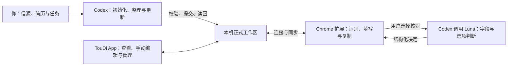
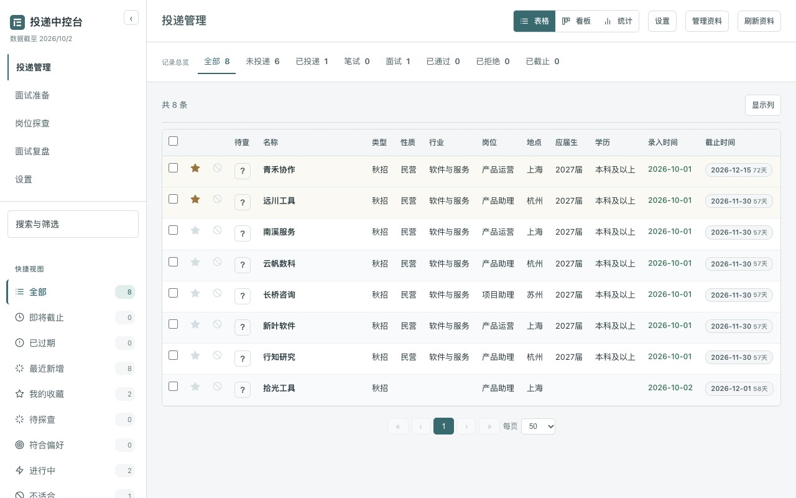
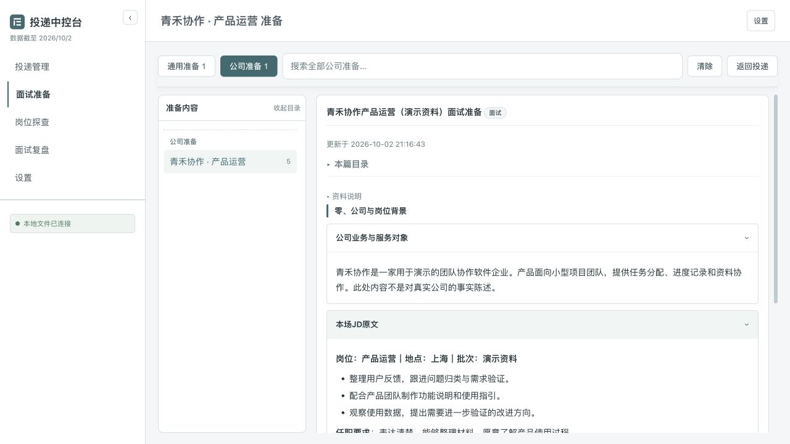

<picture>
  <source media="(prefers-color-scheme: dark)" srcset="docs/assets/logo-dark.svg">
  
</picture>

# TouDi with Codex

**TouDi 是与 Codex 协作的个人投递工作台，集中管理招聘记录、求职资料、岗位探查、面试准备、复盘和日程。** Codex 根据你提供的信源与真实材料整理、更新资料；桌面 App 用于查看、编辑和管理；Chrome 扩展在招聘网页识别与填写表单，并可通过 Codex 调用 Luna 核对字段和真实选项。三者使用同一个本机工作区。

**推荐以 Codex 完成初始化和日常维护，同时保留完整的手动操作。** 你可以自行新增记录、编辑经历、导入材料、调整偏好和安排日程；无法自动填写的内容可以在插件中查找并点击复制。

[下载安装包](https://github.com/chenyiwang325-droid/toudi-with-codex/releases) · [开始使用](docs/开始与初始化.md) · [Chrome 辅助填报](docs/辅助填报.md) · [Codex 接入与保存](docs/Agent接入.md)

## 主要功能

**从整理岗位到准备面试，各项任务有独立入口，结果通过公司、岗位和场次关联。**

| 功能 | 可以完成的操作 |
| --- | --- |
| 投递管理 | 搜索和筛选岗位；标记进度、收藏、适合与否和备注；切换表格、看板与统计。 |
| 填报资料 | 维护个人信息、教育、实习、项目、校园经历、获奖与论文；按整段经历编辑，保留完整原文。 |
| Chrome 辅助填报 | 识别当前表单，按模块和记录匹配资料；可选 Luna 核对；补齐经历、填写控件并读回；支持仅填空白及手动复制。 |
| 岗位探查 | 整理公司和岗位的报告、来源与附件，区分事实、判断和待确认内容。 |
| 面试准备与复盘 | 管理通用问答和公司专项；按场次整理真实问答、追问、复盘要点及必要改进。 |
| 日程 | 编辑事项和日期、拖动改期、关联公司与材料；独立按钮启用整份日程同步，后续修改自动更新 macOS 日历，也可导出日历文件。 |

## 开始使用

**默认使用方式是 TouDi App、Codex 和 Chrome 扩展，个人资料保存在电脑上。** 当前源码为 **v0.6.10 macOS Apple Silicon 预览版**；可下载平台与版本以 [Releases 实际附件](https://github.com/chenyiwang325-droid/toudi-with-codex/releases)为准。App 自带运行组件，不需要另外启动 Python 服务。

1. **安装 TouDi。** 下载对应安装包，按[桌面安装说明](docs/桌面安装与使用.md)打开。首次使用从空工作区开始；已有资料继续使用原工作区。
2. **让 Codex 初始化。** 在本机 Codex 中提供招聘信源、简历和本次任务，发送[开始指南中的启动消息](docs/开始与初始化.md#3-让-codex-完成初始化)。Codex 确认绑定工作区、整理资料，并根据指定信源核对默认分类。
3. **配置 Luna 填报核对。** 安装 Chrome 工具包并连接同一工作区，在“Agent 协作”选择“本机 Codex”，检查连接，选择目录中的 `gpt-6-luna`，保存设置。完整步骤见[辅助填报](docs/辅助填报.md#安装与首次配置)。
4. **在招聘页使用。** 点击 TouDi 图标后先查看识别结果；需要时点击“Agent 核对”，再点击“自动填写”。查看最终值和未完成项，网页保存、附件上传和申请提交由你分别操作。

**Codex 使用 ChatGPT 登录，填报核对消耗该账号现有的 Codex 额度。** 本项目不要求 API Key、额外模型 API 或托管服务。Luna 是否可调用取决于当前客户端与账号；程序读取实际模型目录，不自动换模型。Luna 不可用时，本地识别、明确匹配的填写和资料复制仍可使用。

## 与 Codex 协作

**你提供材料和任务，Codex 整理并保存，TouDi 展示与管理结果；Luna 负责填报中的语义核对。**



**日常直接安排明确任务，无需重复初始化。** 例如：

```text
更新这份招聘表中的记录，保留已有进度、收藏和备注。
根据这份 JD 和实际投递简历准备面试，保存到对应公司。
核对这几个岗位的要求与来源，保存探查报告及附件。
复盘这份面试逐字稿，保留真实问答，保存到对应场次。
对照我的简历补齐填报资料，保留完整描述，不自行压缩或补造事实。
```

**Codex 与手动编辑使用同一套保存规则。** 每次读取最新资料和版本，校验候选、提交、读回；冲突时保留候选并核对差异。打开中的 App 自动接收资料更新，正在编辑的板块保留草稿。具体任务、数据结构和 Markdown 排版见[流程协作](docs/流程协作.md)及[内容与渲染契约](docs/内容与渲染契约.md)。

## 界面预览

**投递管理将固定阶段总览、搜索筛选和岗位列表放在同一视图中。** 以下截图均使用虚构资料。



**面试准备按公司和章节组织背景、JD、主答与备答，便于检索和复习。**



## 数据、费用与支持范围

**个人资料留在自己的工作区，公开仓库和安装包只提供程序与通用结构。** 资料不会随着 GitHub 项目更新而上传；公开截图使用虚构内容。模型核对只传待核字段、实际选项和必要的非敏感候选事实。范围见[隐私与公开发布](docs/隐私与公开发布.md)。

**当前提供 macOS Apple Silicon 预览构建，采用临时签名，未进行正式公证。** Windows 与其他架构尚待实机验收。浏览器填写按共享的 DOM 与控件协议适配不同页面；部分控件或新增记录流程可能仍需人工处理，不承诺所有招聘网站均可完整填写。

**其他设备查阅和在线托管是可选方式。** 加密静态网页展示最近发布的只读资料；已有 Python 托管能力继续保留。它们不属于首次使用的必需步骤，见[使用方案](docs/使用方案.md)。

## 文档与开发

| 文档 | 内容 |
| --- | --- |
| [开始使用](docs/开始与初始化.md) | 安装、Codex 初始化、信源纠偏、资料建立与第一次任务。 |
| [Codex 接入与保存](docs/Agent接入.md) | 定位 App 工具、读取绑定工作区、版本校验与提交。 |
| [Chrome 辅助填报](docs/辅助填报.md) | 扩展安装、工作区同步、Luna 配置、识别与填写。 |
| [编辑与保存](docs/编辑与保存.md) | 手动操作、保存范围、草稿与冲突处理。 |
| [日程安排](docs/日程安排.md) | 事项编辑、公司关联及系统日历连接。 |
| [备份与迁移](docs/备份与迁移.md) | 换机、恢复、原地接入与版本升级。 |
| [流程协作](docs/流程协作.md) | 各任务的输入、操作、输出与验收。 |
| [内容与渲染契约](docs/内容与渲染契约.md) | 数据结构、完整原文、Markdown 与关联规则。 |
| [开发与贡献](docs/开发与贡献.md) | 源码结构、构建、测试和问题反馈。 |

**开发者可以直接从源码运行和构建，沿用与 App 相同的界面和资料格式。** 见[源码运行](docs/首次使用与部署.md)及[开发与贡献](docs/开发与贡献.md)。反馈问题时请提供去除私人信息的操作步骤和控件特征，不上传简历、工作区或凭据。

本项目为独立开源工具，开源协议：[MIT](LICENSE)。
