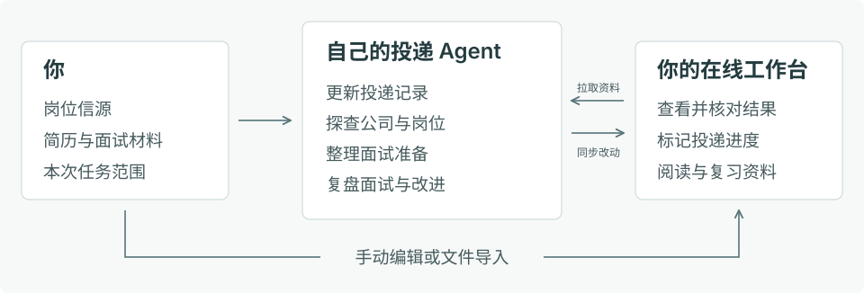

<picture>
  <source media="(prefers-color-scheme: dark)" srcset="docs/assets/logo-dark.svg">
  
</picture>

# TouDi / 投递中控台 · 桌面求职工作台

**TouDi 是与自己的 Agent 协作的个人求职工作台，用于集中管理投递记录、面试准备、岗位探查和面试复盘。** 桌面 App 复用现有 HTML 界面，让你手动维护资料、查阅与复习，也可以让自己的 Agent 按任务整理信源和材料；两种方式使用同一个持久工作区。需要在其他设备查阅时，可另行发布加密只读网页。

**普通用户从 GitHub Releases 下载安装包，打开 App 即可开始管理。** 应用随包提供运行组件，无需自行安装 Python 或启动服务。源码运行适合开发与替代部署；应用不内置模型订阅，Agent 工具由你选择。

[下载安装包](https://github.com/chenyiwang325-droid/toudi-workbench/releases/latest) · [安装与使用](docs/桌面安装与使用.md) · [开始与初始化](docs/开始与初始化.md) · [Agent 接入](docs/Agent接入.md) · [备份与迁移](docs/备份与迁移.md)

## 主要功能

**四个业务模块在同一工作台管理，资料与个人标记保持关联。**

| 功能 | 用途 |
| --- | --- |
| **投递管理** | 管理岗位、日期与来源，维护进度、收藏、适合与否和备注，在表格、看板与统计间切换。 |
| **面试准备** | 管理通用问答与公司专项，按公司查阅背景、JD、主答和备答。 |
| **岗位探查** | 管理公司报告与附件，保留事实、依据、判断和待核实事项。 |
| **面试复盘** | 管理场次、原问答与追问、全场要点及必要改进。 |

**手动管理与 Agent 更新共用保存规则。** 各模块的新增、编辑、导入、导出与删除恢复入口，以及配置和备份范围见[编辑与保存](docs/编辑与保存.md)。主题、显示密度、求职偏好和草稿有各自明确的保存范围。

**Chrome 辅助填报与 App、Agent 共用正式工作区的填报资料。** App 和扩展提供同一套通用资料表单，无需手写 JSON。扩展首次显式连接工作区后，在读取、保存与识别时核对版本并同步；离线编辑先保存在 Chrome，恢复连接后再同步，冲突保留双方供核对。也可离线独立填写。Agent 协作由用户初始化配置，可选择现有 Codex 的模型，或复制任务交给自己的 Agent。浏览器工具包随 Release 提供，安装与使用见[Chrome 辅助填报](docs/辅助填报.md)。

## 安装与开始使用

**桌面 App 当前为 v0.5.2，定位为 macOS Apple Silicon 预览版；浏览器扩展修正版为 [v0.5.2](https://github.com/chenyiwang325-droid/toudi-workbench/releases/tag/v0.5.2)。** 下载以最新 Release 中实际提供的附件为准。 完整源码、安装包与已验证范围随 Release 发布，平台与签名边界见安装说明。

**先选择对应系统与架构的 Release 文件，再按安装说明打开应用。** 当前版本的平台测试与签名情况以 Release 说明为准；macOS 测试构建采用临时签名，未正式公证，首次下载可能遇到系统确认或拦截。Windows 已提供 CI 构建模板，构建结果以实际任务为准，仍待 Windows 实机验收。

1. 从 [桌面 Release](https://github.com/chenyiwang325-droid/toudi-workbench/releases/latest) 下载对应安装包，按[桌面安装与使用](docs/桌面安装与使用.md)安装。
2. 打开 TouDi，新用户从空工作区开始；已有规范资料可选择“选择已有工作区”，先验证再绑定原目录。
3. 在需要的空模块点击主要动作，先添加一条记录、一项通用准备、公司准备、探查报告或复盘场次。通用准备使用分类与条目表单，公司准备自动建立标题与章节。
4. 需要 Agent 时，在“设置 → 开始与协作”确认首次接入，再从模块的“交给 Agent”复制本次任务消息并提供必要材料。只有首次读取或新增招聘信源时核对分类；保存后点击“刷新资料”核对正文、标记与附件。

**App、源码浏览器与 Agent 可以直接使用同一个资料目录。** 推荐让 Agent 整理与管理，也保留手动新增、导入和编辑。已有资料可以原地接入，正文与附件不必搬迁；业务更新保存后刷新显示，不需要重新打包。HTML/CSS 等界面代码修改仍需构建新 App。接入与恢复前先备份，始终明确唯一母本。

## Agent 协作

**把信源、材料和本次任务交给自己的 Agent，按[开始指南](docs/开始与初始化.md)完成第一次更新。** 默认行业层级和常用学历可直接选择；只有招聘记录任务首次读取或新增信源时，由 Agent 对照原词纠偏；特殊或不明要求自动保留。Agent 在已授权的电脑上定位 TouDi 工具、读取当前绑定，沿用已有规则与流程。启动消息不附带个人目录或资料值。日常直接安排更新、准备、探查或复盘，无需重新初始化；只有聊天能力的工具可先整理文件，由你手动导入。

**每次任务可以独立安排，授权范围保持明确。** 例如“更新这批岗位并保留原标记”“根据这份 JD 准备面试”或“复盘这场面试”；操作遵循读取最新母本、处理与校验、提交保存、读回及界面验收。完整接入话术和工具说明见[Agent 接入](docs/Agent接入.md)。

## 界面预览

以下界面使用虚构资料展示。

### 投递管理

岗位信息与个人标记集中在同一张表中，左侧提供快捷视图，上方显示各阶段数量。

### 面试准备

通用准备与公司准备分别管理；公司专项以目录组织背景、JD 和问答，正文逐项展开阅读。

## 可选的网页查阅与托管

**加密静态网页用于查阅最近一次发布的资料，桌面工作区继续作为正式母本。** 网页不写回业务资料；桌面保存后需重新构建、发布，其他设备才会看到更新。已发布网页无需电脑常开，发布失败保留上一版本。

**已有 Python 托管能力继续保留，供需要在线实例的用户自行选择。** 完整云端编辑与同步增强属于后续可选方向，不是桌面使用的前提。选择在线实例时应明确唯一母本，不能让桌面与云端各自修改再盲目覆盖。见[使用方案](docs/使用方案.md)及[云端部署](docs/云端部署.md)。

**个人资料、筛选偏好和信源配置留在自己的工作区。** 公开仓库与安装包只提供通用程序和虚构展示资料；公开发布同时检查源码及安装包内部，构建缓存和本机路径不应进入附件。边界与发布检查见[隐私与公开发布](docs/隐私与公开发布.md)。

## 文档

| 文档 | 内容 |
| --- | --- |
| [桌面安装与使用](docs/桌面安装与使用.md) | 下载、安装、工作区、日常操作与版本边界。 |
| [Agent 接入](docs/Agent接入.md) | 自己的 Agent、资料工具、任务范围和保存流程。 |
| [备份与迁移](docs/备份与迁移.md) | 完整备份、恢复、已有资料迁移与升级。 |
| [使用方案](docs/使用方案.md) | 桌面母本、日常协作与可选网页。 |
| [编辑与保存](docs/编辑与保存.md) | 模块操作、保存位置与冲突保护。 |
| [首次使用与部署](docs/首次使用与部署.md) | 源码运行与可选加密查阅版。 |
| [云端部署](docs/云端部署.md) | 已有 Python 在线托管、登录与同步。 |
| [流程协作](docs/流程协作.md) | 各业务任务的输入、操作和验证。 |
| [内容与渲染契约](docs/内容与渲染契约.md) | 数据字段、Markdown、身份关联和渲染。 |
| [Chrome 辅助填报](docs/辅助填报.md) | 独立插件、私人资料、可配置的 Agent 协作与填写核验。 |
| [开发与贡献](docs/开发与贡献.md) | 源码结构、桌面构建、测试与问题反馈。 |
| [隐私与公开发布](docs/隐私与公开发布.md) | 个人资料、接入说明、截图和安装包的公开边界。 |

欢迎通过 Issues 反馈问题或提交改进。开源协议：[MIT](LICENSE)。
