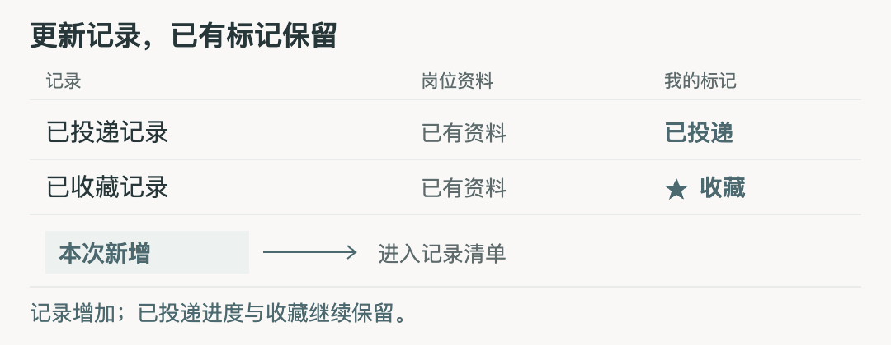
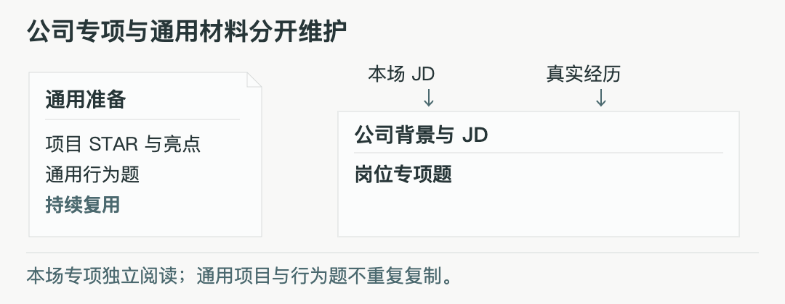
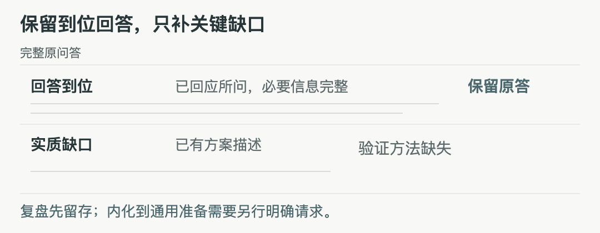

<picture>
  <source media="(prefers-color-scheme: dark)" srcset="docs/assets/logo-dark.svg">
  
</picture>

# TouDi / 投递中控台

TouDi 是求职工作台，用于投递管理、面试准备、岗位探查与复盘。推荐使用自己的投递 Agent 协作，也保留网页手动操作和规范文件导入。

[功能](#功能) · [快速开始](#快速开始) · [使用方式](#使用方式) · [数据与手机部署](#数据与手机部署) · [文档与贡献](#文档与贡献)

## 功能

以下图为简化协作示意，不是完整产品截图或个人记录。

### 投递管理

更新岗位信息时，保留已有**进度、收藏、判断与备注**。在表格、看板或统计中查看记录，通过搜索筛选找到本次需要处理的岗位。

<picture>
  <source media="(max-width: 600px)" srcset="docs/assets/record-update-mobile.png">
  <source media="(prefers-reduced-motion: reduce)" srcset="docs/assets/record-update-static.png">
  
</picture>

### 面试准备

公司专项围绕**本场 JD 和真实经历**组织，通用项目与行为题集中维护。公司背景与 JD 前置，每道专项问题有独立主答和追问备答；你可以检索当前准备模式的全部资料，定位题目并展开阅读。

<picture>
  <source media="(max-width: 600px)" srcset="docs/assets/interview-preparation-mobile.png">
  <source media="(prefers-reduced-motion: reduce)" srcset="docs/assets/interview-preparation-static.png">
  
</picture>

### 面试复盘

复盘保留完整原问答与追问，**到位回答保留，实质缺口才改进**。全场要点先呈现，逐题依据随后展开；需要把复盘收获内化到通用准备时，再明确指定目标与范围。

<picture>
  <source media="(max-width: 600px)" srcset="docs/assets/interview-review-mobile.png">
  <source media="(prefers-reduced-motion: reduce)" srcset="docs/assets/interview-review-static.png">
  
</picture>

### 岗位探查

按公司阅读主报告、证据与未覆盖项。事实、推断与未知分别呈现，帮助你了解岗位和公司。

### 手机阅读

用加密快照阅读记录、准备、探查和复盘。手机只读，编辑回到本地；浅色、深色、系统主题及阅读偏好可调整。

## 快速开始

下载后运行本地服务，浏览器即可打开空工作台。需要 Python 3.10+，支持 macOS/Linux，无前端构建步骤。

```sh
git clone https://github.com/chenyiwang325-droid/toudi-workbench.git
cd toudi-workbench
python3 run.py
```

打开 http://127.0.0.1:8327/ 。选择下面的 Agent 协作或手动路径，加入自己的记录与资料。[首次使用说明](docs/首次使用与部署.md)列出工作区与依赖要求。

## 使用方式

### 推荐使用投递 Agent

你指定信源、真实资料和本次任务。投递 Agent 在你自己的工具环境中核对、整理和更新，工作台保存产物，供你阅读、标记与复用。

网页不自带聊天模型或 Agent 调度器；探查、准备、内化和发布分别按你的请求执行。

给自己的 Agent 复制以下话术，并补齐花括号内容：

```text
请维护我的 TouDi 工作台。仓库目录：{下载目录}；资料目录：{工作区}。
先读 AGENTS.md、docs/流程协作.md、docs/内容与渲染契约.md。
信源：{网址/文件/可用工具}；真实资料：{简历/JD/经历/面试记录}。
本次只执行：{任务与范围}。
先核对缺口，再生成候选、检查变更、保留无关标记与正文，
更新后验证实际工作台。不要自动扩展到网申、联系、内化或发布。
手机同步的口令、托管目标与发布范围由我另行指定。
```

### 手动操作

工作台支持手动维护资料。网页可进行以下操作：

- 投递记录：修改进度、收藏、是否适合、待查与备注；在详情里覆盖岗位、地点等支持字段；导入和导出个人标记/偏好备份。
- 通用准备：新增分类和条目，编辑、删除已有内容。
- 面试复盘：编辑已有场次、原答、分析与总结，维护弱项记录。

新增记录、公司稿和复盘稿目前通过规范文件与命令接入。公司准备稿可自行编辑 Markdown 后导入；探查报告可自行编写并登记目录。具体命令见[流程协作](docs/流程协作.md)。这些是文件/命令操作，不是网页上传入口。

## 数据与手机部署

本地可编辑投递标记、通用准备和已有复盘；公司准备从 Markdown 稿导入后阅读。个人资料留在自己的工作区，源码不包含业务记录。

手机使用**加密只读快照**，编辑回到本地。口令、托管目标和发布范围由用户指定；部署步骤和资料保护见[首次使用与部署](docs/首次使用与部署.md)。

## 文档与贡献

- [首次使用与部署](docs/首次使用与部署.md)：启动、工作区、Agent 接入和加密快照发布。
- [流程协作](docs/流程协作.md)：各任务的输入、输出、验证与失败恢复。
- [内容与渲染契约](docs/内容与渲染契约.md)：字段、Markdown 结构、关联和解析边界。
- [开发与贡献](docs/开发与贡献.md)：结构、隔离测试和问题反馈。

反馈问题时请提供可复现步骤，并替换个人资料与凭据。MIT License，见 [LICENSE](LICENSE)。

A job-search workbench for collaborating with your own Agent. Local editing and encrypted read-only mobile access.
