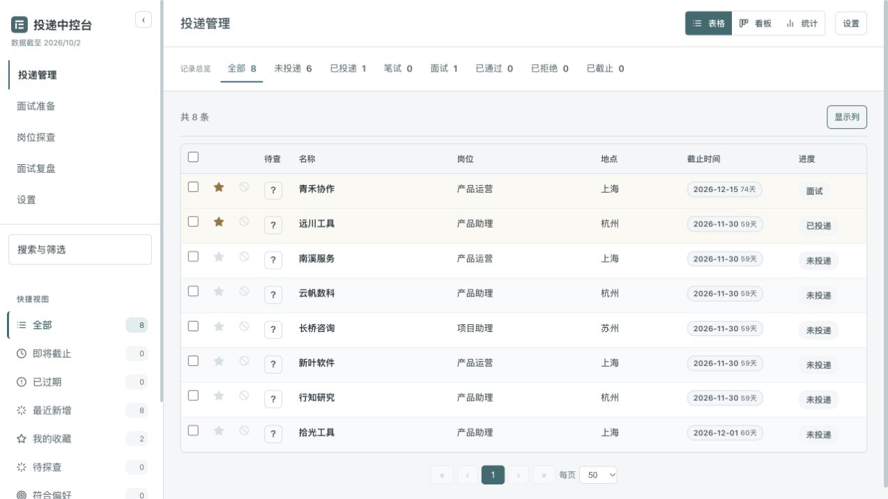
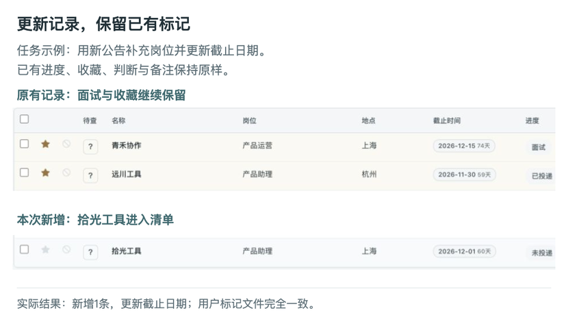
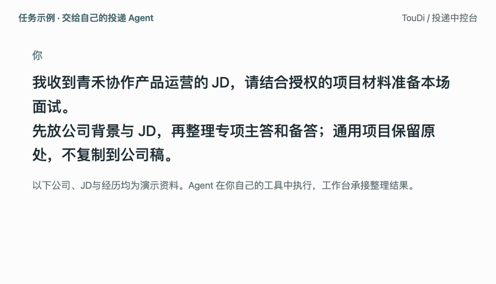
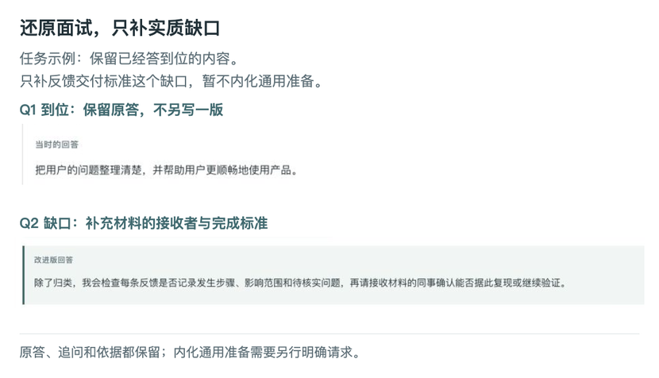

<picture>
  <source media="(prefers-color-scheme: dark)" srcset="docs/assets/logo-dark.svg">
  
</picture>

# TouDi / 投递中控台

**TouDi 是用于个人求职管理、与自己的投递 Agent 协作的本地工作台。** 它把岗位清单、投递进度、公司材料、通用面试准备、岗位探查与面试复盘放在同一个阅读和管理界面，便于持续更新与复习。

项目包含三个部分：**浏览器工作台**用于筛选、标记、阅读和支持的手动编辑；**文档规范与导入脚本**用于整理、验证和接入资料；可选的**手机加密快照**用于随时只读复习。源码提供空工作台，个人记录与资料保存在自己的工作区。

推荐使用自己的投递 Agent 从你指定的信源与材料整理更新，也可以手动操作。Agent 在你的外部工具环境中执行任务，TouDi 保存并呈现产物；网页没有内置聊天模型，不会自行启动探查、准备或发布。

[主要功能](#主要功能) · [实际协作演示](#实际协作演示) · [快速开始](#快速开始) · [接入自己的 Agent](#接入自己的-agent) · [手动使用](#手动使用) · [数据与手机使用](#数据与手机使用) · [文档与贡献](#文档与贡献)

## 主要功能

工作台按求职任务组织内容，各模块保留自己的材料和阅读入口。

| 模块 | 用途与结果 |
| --- | --- |
| 投递管理 | 用表格、看板与统计筛选岗位清单，维护进度、收藏、判断、待查及备注，保留岗位信息与来源链接。 |
| 面试准备 | 通用资料与公司专项分开维护，检索当前模式正文，逐题展开公司背景、JD、主答与备答。 |
| 岗位探查 | 按公司阅读报告、证据、日期、未知项与附件，记录后续核实事项。 |
| 面试复盘 | 按公司、岗位和轮次定位场次，先读全场要点，再核对原答、追问、分析与必要改进。 |
| 设置与阅读 | 调整主题、密度、每页数量及求职偏好，备份个人标记与显示偏好。 |
| 手机阅读 | 解锁独立的加密只读快照，阅读各模块资料与按需附件。 |

## 实际协作演示

<picture>
  <source media="(max-width: 600px)" srcset="docs/assets/product-overview-mobile.png">
  
</picture>

以下展示由真实工作台截图与HTML编排制作，不是连续录屏。画面来自当前工作台的隔离实例；公司、经历和问答均为明确标注的演示资料。“任务示例”说明给外部 Agent 的请求，不是工作台内置聊天。

### 更新清单，保留已有标记

新公告补入清单时，已有进度、收藏、判断与备注继续保留。示例中新增一条招聘记录并更新截止日期，原有的面试和收藏标记不变。

<picture>
  <source media="(max-width: 600px)" srcset="docs/assets/records-result-mobile.png">
  
</picture>

### 收到JD，形成可复习的公司准备

公司准备前置背景与本场 JD，再组织岗位相关问题的主答和备答。通用项目保留在通用准备，公司专项只补本场需要的迁移判断；导入后可以在目录和搜索结果中定位、展开阅读。

<picture>
  <source media="(max-width: 600px)" srcset="docs/assets/preparation-workflow-mobile.png">
  <source media="(prefers-reduced-motion: reduce)" srcset="docs/assets/preparation-workflow-static.png">
  
</picture>

<details>
<summary>查看这次协作的文字版</summary>

**请求**：我收到青禾协作产品运营的 JD，请结合授权的项目材料准备本场面试。先放公司背景与 JD，再整理专项主答和备答；通用项目保留原处，不复制到公司稿。

**执行与结果**：Agent 核对材料、整理公司专项，预检文档及公司关联，再通过脚本导入并读取结果验证。工作台新增 **5 条公司准备条目**；通用项目没有复制。在“面试准备 → 公司准备”打开青禾协作，可以阅读背景和 JD，展开专项主答与备答。

</details>

### 还原面试，只改实质缺口

复盘保留原问答与追问，先给全场要点，再说明逐题依据。回答到位的部分保留；需要补充交付标准的题目才给改进稿。把复盘收获内化到通用准备，需要另行明确请求。

<picture>
  <source media="(max-width: 600px)" srcset="docs/assets/review-result-mobile.png">
  
</picture>

## 快速开始

本地服务需要 **Python 3.10+**，支持 macOS/Linux；浏览器界面无需前端构建。

```sh
git clone https://github.com/chenyiwang325-droid/toudi-workbench.git
cd toudi-workbench
python3 run.py
```

打开 http://127.0.0.1:8327/ 即可进入空工作台。资料默认保存在仓库的 `runtime/`。告诉 Agent 仓库下载位置，或选择下方手动路径，即可加入自己的记录与资料；可选工作区设置见[首次使用与部署](docs/首次使用与部署.md)。加密快照另需安装 `requirements.txt` 中的依赖。

## 接入自己的 Agent

你提供信源、真实材料和本次范围，Agent 按仓库文档执行相应任务。记录更新、探查、准备、复盘、内化和手机发布都是独立流程，可以单独调用。

复制以下话术并补齐花括号内容：

```text
请维护我的 TouDi 工作台。
仓库目录：{下载目录}。
资料工作区使用默认 runtime，除非我另行指定。
先读取仓库 AGENTS.md、docs/流程协作.md、docs/内容与渲染契约.md。
我的信源：{网址/文件/可用工具}。
我的真实资料：{简历/JD/项目经历/面试记录}。
本次任务与范围：{明确公司、记录或场次及所需产物}。
先核对资料缺口，再整理候选、检查变更并接入工作台。
保留无关标记和正文，验证导入结果与实际页面。
不要自动扩展到网申、联系招聘方、题库内化或手机发布。
如需手机同步，我会另行指定口令、托管目标和发布范围。
```

每次任务可直接指定结果，例如“更新这批记录并保留原标记”“准备这家公司本场JD”“复盘这场记录，暂不内化”。完整的输入、步骤、验证和失败恢复见[流程协作](docs/流程协作.md)。

## 手动使用

工作台支持手动维护资料。网页可进行以下操作：

- **投递记录**：修改进度、收藏、是否适合、待查与备注；在详情中覆盖岗位、地点等支持字段；导入和导出个人标记与偏好备份。
- **通用准备**：新增分类和条目，编辑、删除已有内容。
- **已有复盘**：编辑场次信息、原答、分析和总结，维护弱项记录。

新增招聘记录、公司准备、探查报告和新复盘通过文档格式与命令接入，无需 Agent。公司准备可自行编辑 Markdown 后重新导入，探查报告可自行编写并登记目录。这些是文件与命令入口，不是网页上传功能；具体步骤见[手动接入说明](docs/首次使用与部署.md)。

## 数据与手机使用

个人资料保存在自己的本地工作区，公开源码不包含业务数据。编辑与导入使用各自的数据校验和冲突处理，具体见内容契约；公司准备以 Markdown 稿为修改入口。备份功能的具体范围见界面说明，不代表导出了所有资料。

手机使用可选的**加密只读快照**，编辑回到本地。口令、Cloudflare目标与发布范围由你指定；只上传构建产物，不上传个人工作区或凭据。依赖、构建与部署步骤见[首次使用与部署](docs/首次使用与部署.md)。

## 文档与贡献

- [首次使用与部署](docs/首次使用与部署.md)：启动、资料工作区、手动接入和加密快照。
- [流程协作](docs/流程协作.md)：各任务的输入、输出、验证与失败恢复。
- [内容与渲染契约](docs/内容与渲染契约.md)：字段、Markdown结构、关联与解析边界。
- [开发与贡献](docs/开发与贡献.md)：项目结构、隔离测试与问题反馈。

反馈问题时请提供可复现步骤，并替换个人资料与凭据。MIT License，见 [LICENSE](LICENSE)。

A local job-search workbench for collaborating with your own Agent, with manual editing and optional encrypted read-only mobile access.
