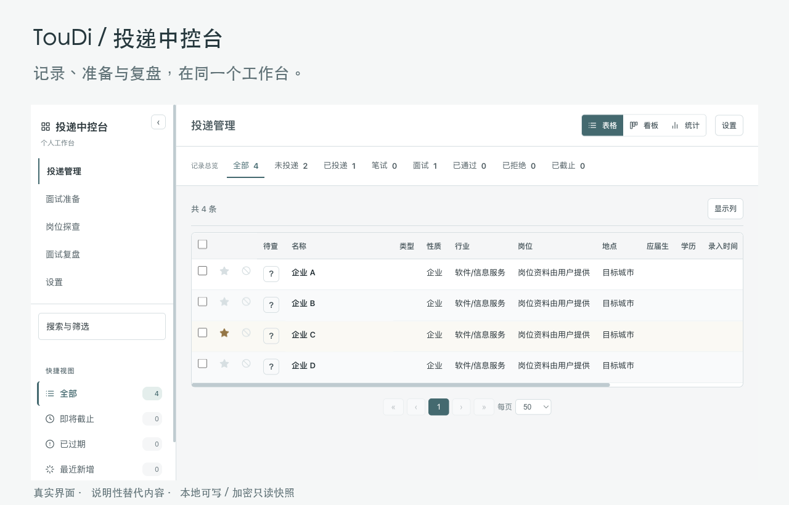
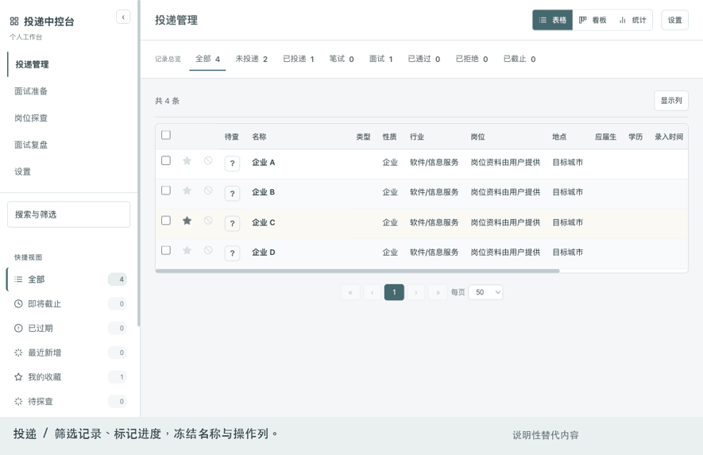

<p align="left"></p>

# 把投递、准备与复盘放在同一个工作台

TouDi 是与自己的 Agent 协作维护的个人投递中控台。页面负责记录、筛选和阅读，Agent 在你的环境里按固定契约处理信源与资料。本地可写，手机与托管版本为加密只读快照。

A personal application and interview workbench. Local edits, structured preparation, research and review; encrypted read-only snapshots. Bring your own sources and Agent.



[开始使用](docs/首次使用与部署.md) · [给 Agent 的固定接入话术](docs/首次使用与部署.md#给自己的-agent-的接入话术) · [内容与渲染契约](docs/内容与渲染契约.md) · [流程协作](docs/流程协作.md)

## 看一轮操作



演示使用真实界面与明确的抽象替代文本，不包含任何真实投递记录或回答，也不作为运行时示例库。[静态概览](docs/assets/overview.png)和[可点击本地演示](docs/demo.html)用于不播放动画的环境；下载后打开演示可自行切换步骤。

## 日常使用

| 任务 | 页面提供的能力 |
|---|---|
| 管理投递 | 表格、看板、统计；统一搜索筛选；收藏、不适合、待探查、进度、备注及批量操作；连续冻结标记与名称列 |
| 阅读准备 | 通用与公司入口；分类/项目/独立条目；全模式搜索、定位与返回；主答与备答、链接和附件；通用草稿与编辑 |
| 查阅岗位探查 | 公司目录、已登记报告与附件；结论、证据、日期和边界；待查与已有报告筛选 |
| 面试复盘 | 全场结论前置；逐题原答、追问、诊断及必要改写；已有场次可编辑保存 |
| 设置偏好 | 浅色/深色/系统主题、短切换反馈、阅读密度、每页数量、默认模块及求职偏好；表格附近选择显示列 |
| 保存与同步 | 同源本地服务、base版本与409冲突保护；独立标记/偏好与资料母本；加密只读手机版与按需附件 |

这不是网页内的 Agent 服务：没有模型账号、API Key 管理或后台自动执行。你选用的 Agent 读取仓库契约，使用自己的工具与你确认信源、生成规范产物、验证并更新。没有默认抓取网站、特定作者的公司判断、示例业务库或通用导入向导。

## 启动

Python 3.10+，macOS/Linux。只用本地工作台不需要前端构建或额外 Python 包：

```sh
git clone https://github.com/chenyiwang325-droid/toudi-workbench.git
cd toudi-workbench
python3 run.py
```

打开 http://127.0.0.1:8327/ 。干净下载默认是空工作台。资料在 `runtime/` 或你指定的仓库外工作区，受跟踪的页面模板始终没有个人记录。需要快照时安装 `requirements.txt`；PDF文本提取的可选系统依赖及工作区设置见[首次使用与部署](docs/首次使用与部署.md)。Windows 的原生文件锁暂不支持，可使用 Linux 环境；没有随包分发作者的macOS应用。

## 与 Agent 协作

你提供信源、真实资料、任务范围及可选托管目标，Agent依次执行：

**读取契约和母本 → 生成目标候选 → 校验身份/证据/版本 → 原子更新 → 实际阅读验证。**

记录源适配由用户 Agent 完成。本仓库的 `publish_records.py` 仅接收已经符合字段契约的数组，执行验证、SHA冲突检查、文件锁和原子替换，保留独立标记文件；它不是外部网站抓取器或通用导入器。公司准备与复盘提供真实Markdown解析器，探查读取明确登记的报告，通用准备使用公开JSON契约。全部流程无作者私有skill依赖，详见[流程协作](docs/流程协作.md)。

## 本地与手机的边界

本地服务只监听 loopback；网页写入需要当前文件版本，冲突不覆盖。手机快照在本机 gzip 后使用 PBKDF2-HMAC-SHA256 150000 次与 AES-256-GCM 加密；密文独立资源按需加载，解锁后只读。浏览器不会因一段目录路径就取得你的本机文件，也不会从公开页面探测本地写接口。

GitHub 仅放源码与脱敏展示。口令、token、个人JSON、Markdown、附件、密文、运行目录及备份不进仓库。Cloudflare部署只传你自己的 `.stage`，目标来自用户，不设置作者生产站默认值。[部署步骤与核对范围](docs/首次使用与部署.md#部署到自己的-cloudflare-pages)。

## 仓库结构

```text
app/                  页面空模板、本地服务、原子发布/材料解析/快照脚本
app/assets/           产品标识与favicon
docs/                 使用、部署、流程、内容契约与说明性演示
tests/                临时工作区中的运行/保存/导入/加密检查
run.py                loopback启动入口
runtime/              运行时个人工作区，不入仓（首次运行创建目录）
```

```sh
python3 -m pip install -r requirements.txt
python3 -m unittest discover -s tests -v
python3 tests/check_source.py
```

测试只创建临时结构性资料，退出后清理。[可选 GitHub Actions 配置](docs/github-actions-check.yml)只检查源码和隔离运行，不自动部署；需要自动检查时，将它放到 `.github/workflows/check.yml` 并使用有工作流提交权限的账号凭据。当前仓库提供模板，尚未启用自动检查。MIT License，见 [LICENSE](LICENSE)。
