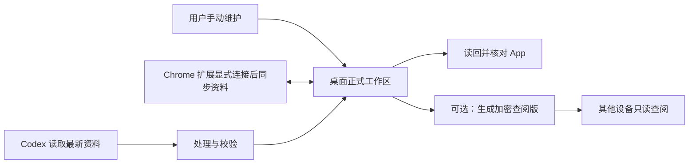

# 使用方案

**TouDi 默认通过桌面 App 完整管理求职资料，手动维护与本机 Codex 共用同一个持久工作区。** GitHub 分发源码与安装包，个人资料保存在安装目录外；普通用户无需配置 Python 服务、托管账号或模型 API。

## 选择使用方式

| 方式 | 用途与边界 |
| --- | --- |
| **桌面 App（默认）** | 本机管理投递、准备、探查、复盘、填报资料、配置与备份；工作区为唯一正式母本。 |
| 源码 Python 运行 | 开发与替代入口，使用同一 HTML 和资料格式。 |
| 加密静态查阅版（可选） | 其他设备解锁查阅最近发布版本，只读。 |
| Python 在线实例（可选） | 保留已有受保护托管与 Agent 同步能力，使用自己的服务与持久存储。 |

**首次使用从安装包开始。** 见[桌面安装与使用](桌面安装与使用.md)。已有资料先按[备份与迁移](备份与迁移.md)核对，迁移后明确唯一写入位置。应用从空工作区开始，不要求导入示例库或复刻作者的招聘信源。

## 日常协作

**每次任务读取最新母本，再校验、保存与读回。** 用户可以手动操作，也可以把任务与真实材料交给 Codex；信源读取、研究和录音转写仍在用户选用的工具环境完成。

**各业务任务保持独立范围。** 更新记录、探查、准备、复盘及内化各按[流程协作](流程协作.md)执行；未知身份、日期和经历保留缺口。版本冲突保留候选，重读差异后合并，不能换 base 强行覆盖。任务不自动扩展为网申、外部沟通或无人值守调度。

**填报资料只共享当前绑定的本机工作区。** App 和扩展使用标准通用表单，Agent 使用相同版本保护；离线修改在 Chrome 待同步，冲突双方保留。它不建立云端母本或完整跨设备同步。

## 网页查阅

**加密静态网页只展示已发布版本。** 桌面修改不会自动写回网页；构建并发布后才更新。电脑关闭后仍可看已有版本，发布失败不回滚桌面母本。显示设置可以保存在访问设备，业务资料仍在正式工作区。发布步骤见[首次使用与部署](首次使用与部署.md#生成加密手机版)。

## 完整网页编辑的后续方案

**远程完整编辑作为可选增强另行设计与验收。** 需要受保护 API、持久存储、附件与版本保护，并明确在线母本或本地母本的同步规则。Cloudflare Workers/D1 可作为候选技术，当前没有该适配；不再作为默认使用前提。

**已有 Python 托管可继续使用。** 见[云端部署](云端部署.md)。切换到在线实例后，应将它明确为唯一正式母本，本机副本用于任务与回退；两处独立写入不等于自动同步。托管配置与真实部署测试范围分别说明，实际费用由用户选择的平台决定。

## 同工作区协作

**桌面 App、源码浏览器与 Agent 共用持久绑定的正式资料目录。** 显式 `TOUDI_WORKSPACE` 优先于连接配置，没有绑定时使用独立空工作区。已有资料按[原地接入流程](备份与迁移.md#原地接入已有工作区)执行预览、备份与基准核对、apply、check、bind 和 App 验收；命令见[Agent 接入](Agent接入.md#工作区绑定与原地接入)。

**业务资料更新保存后刷新即可显示，界面代码更新仍需构建 App。** 统一刷新先保护未保存草稿；App 关闭时 Agent 仍可使用 CLI 更新。原地接入保留正文、附件、题库和最新复盘，不要求重新导入全部资料。

**用户自己的信源处理流程继续保留，只衔接最终保存。** 日期核验、归并、身份迁移、锁、版本保护与附件验证仍属必要步骤；公共项目不内置作者私有抓取链，也不要求付费第三方服务。
